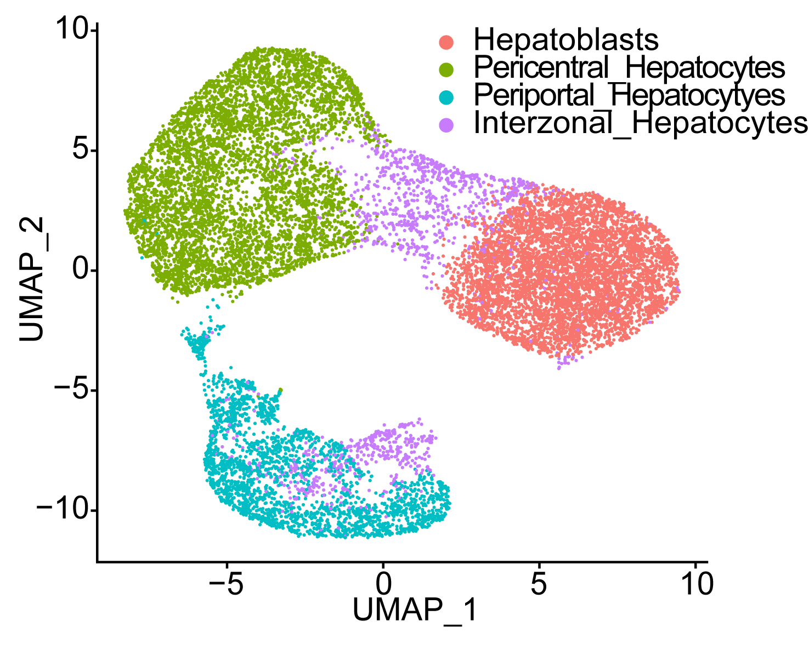
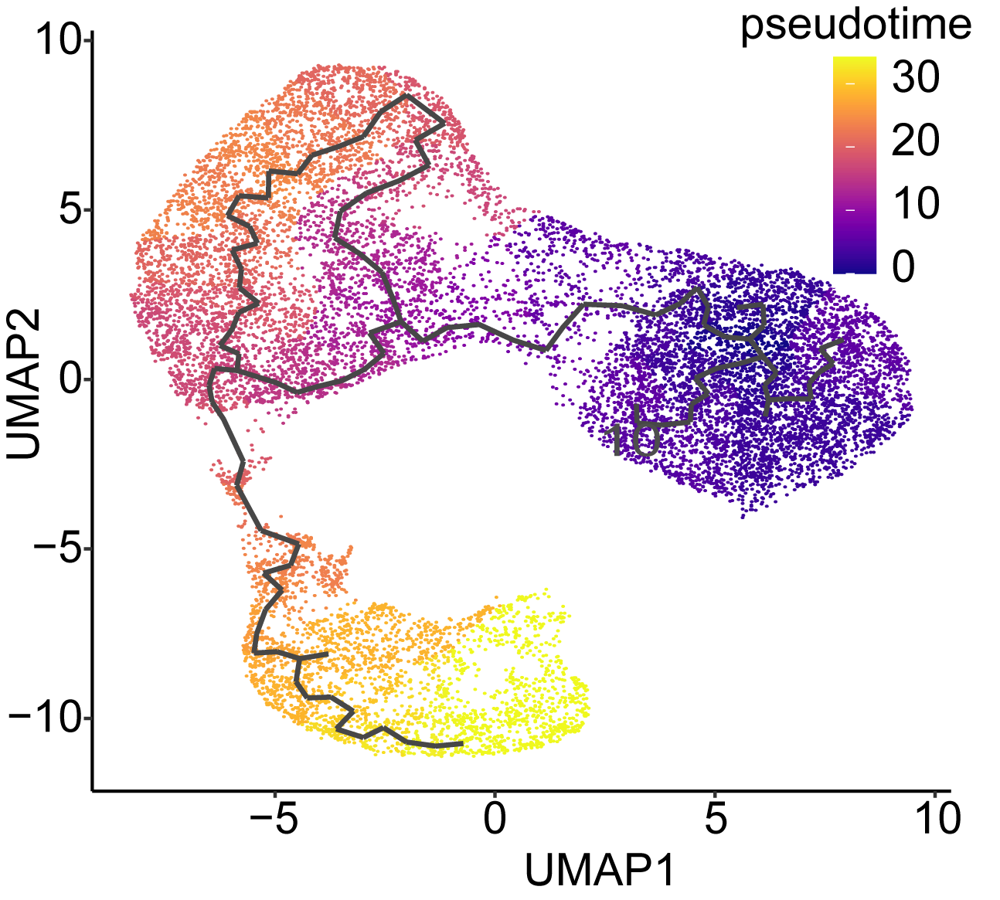
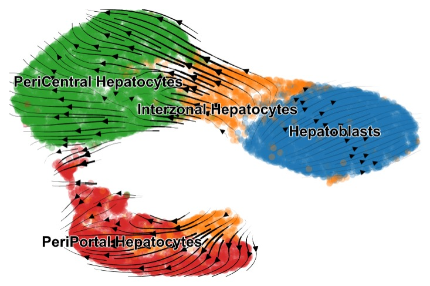
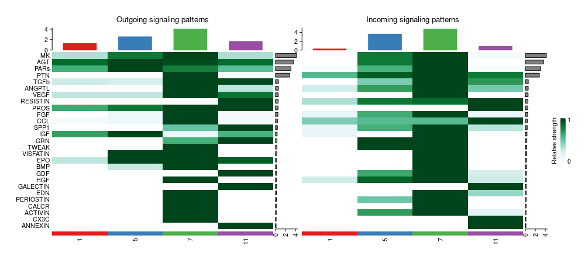

Single-cell RNA-seq analysis is a sequence of representations: a sparse count matrix becomes a quality-controlled Seurat object, then a low-dimensional cellular map, a set of annotated populations, and models of state transitions and cell-cell communication.

This post is based on [Merge.R](Merge.R), [seurat.R](seurat.R), [CellChat.R](CellChat.R), and [RNA_velocity.ipynb](RNA_velocity.ipynb). Every coding example uses generic variables and paths so the workflow can be adapted to another 10x experiment. Record package versions, references, thresholds, and random seeds for a production analysis.

## The analysis map

```text
FASTQ -> Cell Ranger counts -> Seurat QC -> PCA/UMAP/clusters -> markers and labels
             -> integration -> trajectories and gene sets
             -> loom/count export -> scVelo -> CellChat communication
```

## 1. Generate 10x counts with Cell Ranger

Cell Ranger converts demultiplexed 10x FASTQ files into a feature-barcode matrix. Run one `count` job per sample using a reference package built for the matching genome assembly and transcript annotation:

```bash
sample_id="sample_a"
fastq_dir="path/to/fastq"
reference_path="path/to/cellranger_reference"
cores=16
memory_gb=64

cellranger count \
  --id="${sample_id}" \
  --transcriptome="${reference_path}" \
  --fastqs="${fastq_dir}" \
  --sample="${sample_id}" \
  --localcores="${cores}" \
  --localmem="${memory_gb}"
```

For multiple libraries, repeat the command with a distinct `sample_id` and output directory. The downstream Seurat step reads the resulting `outs/filtered_feature_bc_matrix/` directory. Preserve the Cell Ranger version, reference name, chemistry, FASTQ manifest, and command-line parameters with the results. If the FASTQs are still in BCL format, demultiplex them with `cellranger mkfastq` before running `count`.

## 2. Read 10x data

Use an explicit sample table instead of relying on directory order:

```r
library(Seurat)

sample_table <- data.frame(
  sample_id = c("sample_a", "sample_b"),
  matrix_dir = c("path/to/sample_a", "path/to/sample_b"),
  condition = c("condition_a", "condition_b")
)

seurat_list <- lapply(seq_len(nrow(sample_table)), function(i) {
  counts <- Read10X(data.dir = sample_table$matrix_dir[i])
  obj <- CreateSeuratObject(
    counts = counts,
    project = sample_table$sample_id[i],
    min.cells = 3,
    min.features = 200
  )
  obj$sample_id <- sample_table$sample_id[i]
  obj$condition <- sample_table$condition[i]
  obj
})

seurat_obj <- merge(
  x = seurat_list[[1]], y = seurat_list[-1],
  add.cell.ids = sample_table$sample_id,
  project = "scRNAseq_project"
)
table(seurat_obj$sample_id)
```

Cell barcodes must remain unique after merging. Store sample, donor, batch, and condition metadata at this stage so later models can use them.

## 3. Quality control

The source workflow measures mitochondrial content, inspects library metrics, and filters cells:

```r
seurat_obj[["percent.mt"]] <- PercentageFeatureSet(
  seurat_obj, pattern = "^MT-", assay = "RNA"
)
VlnPlot(seurat_obj,
  features = c("nFeature_RNA", "nCount_RNA", "percent.mt"), ncol = 3)

min_features <- 200
max_features <- 4000
max_mito_percent <- 5
seurat_obj <- subset(seurat_obj, subset =
  nFeature_RNA > min_features &
  nFeature_RNA < max_features &
  percent.mt < max_mito_percent)
```

Thresholds are dataset-specific. Review distributions per sample, check doublets, and avoid filtering away a real low-RNA population merely because a generic cutoff was convenient.

## 4. Normalize, reduce, and cluster

```r
seurat_obj <- NormalizeData(seurat_obj)
seurat_obj <- FindVariableFeatures(seurat_obj,
  selection.method = "vst", nfeatures = 2000)
seurat_obj <- ScaleData(seurat_obj, features = rownames(seurat_obj))
seurat_obj <- RunPCA(seurat_obj,
  features = VariableFeatures(seurat_obj), npcs = 30)

dims_to_use <- 1:15
seurat_obj <- FindNeighbors(seurat_obj, dims = dims_to_use)
seurat_obj <- FindClusters(seurat_obj, resolution = 0.5)
seurat_obj <- RunUMAP(seurat_obj, dims = dims_to_use)
DimPlot(seurat_obj, reduction = "umap", label = TRUE, repel = TRUE)
```

Use PCA loadings, elbow plots, and clustering stability to choose dimensions and resolution. For samples with substantial technical variation, the source also demonstrates `SCTransform()`. Make the active assay explicit so integrated and RNA expression are not mixed accidentally.

## 5. Find markers and assign labels

```r
markers <- FindAllMarkers(seurat_obj, only.pos = TRUE,
  min.pct = 0.25, logfc.threshold = 0.25)
top_markers <- markers |>
  dplyr::group_by(cluster) |>
  dplyr::slice_max(order_by = avg_log2FC, n = 10)
DoHeatmap(seurat_obj, features = top_markers$gene) + NoLegend()

marker_panel <- c("marker_a", "marker_b", "marker_c")
DotPlot(seurat_obj, features = marker_panel)
FeaturePlot(seurat_obj, features = "marker_a", order = TRUE)
```

Use multiple markers per candidate cell type and distinguish identity markers from transient state or stress markers. The original R workflow also demonstrates reference transfer; keep predicted labels separate from manually reviewed labels:

```r
anchors <- FindTransferAnchors(
  reference = reference_obj, query = seurat_obj,
  normalization.method = "SCT",
  reference.reduction = "spca", dims = 1:50
)
seurat_obj$annotation <- Idents(seurat_obj)
saveRDS(seurat_obj, "processed_seurat_object.rds")
```

## 6. Integrate multiple samples

```r
sample_objects <- SplitObject(seurat_obj, split.by = "sample_id")
sample_objects <- lapply(sample_objects, function(obj) {
  obj <- NormalizeData(obj)
  FindVariableFeatures(obj, selection.method = "vst", nfeatures = 2000)
})
integration_features <- SelectIntegrationFeatures(object.list = sample_objects)
anchors <- FindIntegrationAnchors(object.list = sample_objects,
  anchor.features = integration_features)
integrated_obj <- IntegrateData(anchorset = anchors)
DefaultAssay(integrated_obj) <- "integrated"
integrated_obj <- ScaleData(integrated_obj, verbose = FALSE)
integrated_obj <- RunPCA(integrated_obj, npcs = 30, verbose = FALSE)
integrated_obj <- RunUMAP(integrated_obj, reduction = "pca", dims = 1:15)
integrated_obj <- FindNeighbors(integrated_obj, reduction = "pca", dims = 1:15)
integrated_obj <- FindClusters(integrated_obj, resolution = 1)
```

Plot sample identity and biology after integration. Overcorrection can erase condition-specific biology. For differential expression, use the appropriate RNA assay and a design that accounts for donor or sample structure rather than blindly testing an integrated matrix.

## 7. Trajectories and gene sets

The source converts Seurat to Monocle3, learns a graph, and orders cells from biologically chosen root cells:

```r
library(SeuratWrappers)
library(monocle3)
cds <- as.cell_data_set(seurat_obj)
rowData(cds)$gene_short_name <- rownames(cds)
cds <- learn_graph(cds, use_partition = FALSE)
cds <- order_cells(cds, reduction_method = "UMAP",
  root_cells = root_cell_ids)
plot_cells(cds, color_cells_by = "pseudotime")
seurat_obj$pseudotime <- pseudotime(cds)
graph_results <- graph_test(cds, neighbor_graph = "principal_graph")
```

Pseudotime is a model-based ordering, not a measured clock. Test alternative roots and report the biological rationale. The scripts also use `presto::wilcoxauc()`, `biomaRt`, and `clusterProfiler` for marker statistics, identifier conversion, GO enrichment, and GSEA:

```r
marker_stats <- presto::wilcoxauc(seurat_obj, "seurat_clusters")
significant_stats <- dplyr::filter(marker_stats,
  padj < 0.05, abs(logFC) > 0.25)
gene_list <- significant_stats$logFC
names(gene_list) <- significant_stats$entrez_id
gene_list <- sort(gene_list, decreasing = TRUE)
gsea_result <- clusterProfiler::gseGO(
  geneList = gene_list, OrgDb = org.Hs.eg.db,
  keyType = "ENTREZID", ont = "ALL", pAdjustMethod = "BY")
```

Remove missing or duplicated identifiers and define the tested-gene universe before interpreting enrichment.

## 8. Export for RNA velocity

The R workflow exports metadata, counts, gene names, and embeddings for reconstruction in Python:

```r
library(Matrix)
seurat_obj$barcode <- colnames(seurat_obj)
seurat_obj$UMAP_1 <- Embeddings(seurat_obj, "umap")[, 1]
seurat_obj$UMAP_2 <- Embeddings(seurat_obj, "umap")[, 2]
write.csv(seurat_obj@meta.data, "metadata.csv", row.names = FALSE)
count_matrix <- GetAssayData(seurat_obj, assay = "RNA", slot = "counts")
writeMM(count_matrix, "counts.mtx")
write.csv(Embeddings(seurat_obj, "pca"), "pca.csv")
write.table(rownames(count_matrix), "gene_names.csv",
  quote = FALSE, row.names = FALSE, col.names = FALSE)
```

The count orientation and barcode order must match across every exported file. A loom file from `velocyto` must use compatible barcodes; normalize barcode suffixes only with a documented, verified mapping.

## 9. Estimate RNA velocity in Python

```python
import anndata as ad
import pandas as pd
import scvelo as scv
from scipy import io

adata = ad.AnnData(X=io.mmread("counts.mtx").transpose().tocsr())
adata.obs = pd.read_csv("metadata.csv").set_index("barcode")
adata.var_names = pd.read_csv("gene_names.csv", header=None)[0].tolist()
adata.obsm["X_pca"] = pd.read_csv("pca.csv", index_col=0).to_numpy()
adata.obsm["X_umap"] = adata.obs[["UMAP_1", "UMAP_2"]].to_numpy()

velocity_data = scv.read("path/to/velocity.loom", cache=True)
velocity_data.var_names_make_unique()
adata = scv.utils.merge(adata, velocity_data)
scv.pp.filter_and_normalize(adata)
scv.pp.moments(adata)
scv.tl.velocity(adata, mode="stochastic")
scv.tl.velocity_graph(adata)
scv.pl.velocity_embedding_stream(adata, basis="umap",
  color="annotation", save="velocity_stream.png")
scv.tl.velocity_confidence(adata)
scv.tl.velocity_pseudotime(adata)
```

For a focused subset, the notebook fits scVelo's dynamical model:

```python
subset_labels = ["state_a", "state_b"]
subset = adata[adata.obs["annotation"].isin(subset_labels)].copy()
scv.pp.filter_and_normalize(subset)
scv.pp.moments(subset)
scv.tl.recover_dynamics(subset)
scv.tl.velocity(subset, mode="dynamical")
scv.tl.velocity_graph(subset)
scv.tl.latent_time(subset)
```

Velocity arrows are model-dependent estimates. Check confidence, known marker progression, preprocessing choices, and controls; velocity does not by itself prove lineage direction.

## 10. Infer cell-cell communication with CellChat

The CellChat script uses normalized RNA expression and cell identities to infer ligand-receptor communication:

```r
library(CellChat)
expression_matrix <- GetAssayData(seurat_obj, assay = "RNA", slot = "data")
cell_labels <- Idents(seurat_obj)
cell_meta <- data.frame(labels = cell_labels, row.names = names(cell_labels))

cellchat <- createCellChat(object = expression_matrix)
cellchat <- addMeta(cellchat, meta = cell_meta, meta.name = "labels")
cellchat <- setIdent(cellchat, ident.use = "labels")
cellchat@DB <- subsetDB(CellChatDB.human, search = "Secreted Signaling")
cellchat <- subsetData(cellchat)
cellchat <- identifyOverExpressedGenes(cellchat)
cellchat <- identifyOverExpressedInteractions(cellchat)
cellchat <- computeCommunProb(cellchat)
cellchat <- filterCommunication(cellchat, min.cells = 10)
cellchat <- computeCommunProbPathway(cellchat)
cellchat <- aggregateNet(cellchat)
```

Visualize network size, strength, and selected pathways:

```r
interaction_table <- subsetCommunication(cellchat)
group_size <- as.numeric(table(cellchat@idents))
netVisual_circle(cellchat@net$count, vertex.weight = group_size)
netVisual_circle(cellchat@net$weight, vertex.weight = group_size)
selected_pathway <- "SIGNALING_PATHWAY"
netVisual_aggregate(cellchat, signaling = selected_pathway, layout = "circle")
netVisual_heatmap(cellchat, signaling = selected_pathway)
cellchat <- netAnalysis_computeCentrality(cellchat, slot.name = "netP")
```

CellChat results are curated database- and expression-based hypotheses, not proof of physical contact or signaling activity. Consider cell abundance, receptor expression, experimental context, and orthogonal validation.

## Reproducibility checks

- Keep raw matrices and derived Seurat/AnnData objects in separate output directories.
- Record the genome build, 10x chemistry, annotation, package versions, thresholds, dimensions, resolution, and seeds.
- Validate barcode order before merging counts, metadata, embeddings, and loom layers.
- The source scripts contain project-specific objects such as `o`, `bm`, and `hlo`; define explicit objects before using them.
- Check that integration removes technical variation without removing the biological condition of interest.
- Treat pseudotime, RNA velocity, and CellChat edges as inferences with assumptions and uncertainty.
- Replace interactive calls and hardcoded paths with configuration values and saved outputs for automated runs.

Preserving the links between cells, assays, metadata, and embeddings at every stage makes it possible to move from a cluster plot to a defensible biological interpretation without losing track of which cells or model produced the result.
